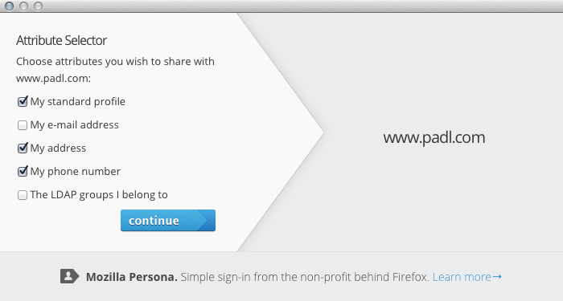

<!-- This Source Code Form is subject to the terms of the Mozilla Public
   - License, v. 2.0. If a copy of the MPL was not distributed with this
   - file, You can obtain one at http://mozilla.org/MPL/2.0/. -->

# Attribute certificates for Persona

Luke Howard <lukeh@padl.com>

December, 2013

## 1. Overview

Attribute certificates are additional certificates issued by an identity provider (IdP) that contain subsets of claims about a principal. (Each subset is called a "scope".) They can be selectively disclosed by the user at authentication time: the IdP does not learn of the claims the user disclosed, nor does the relying party (RP) learn of the claims the user did not disclose.

In layperson's terms: attribute certificates add the ability not just to prove one's e-mail address to a service (as Persona does by design), but also prove a bunch of other things about oneself. You get to decide which things, and your identity provider never finds out which services you're visiting (nor which aspects of your identity you've disclosed).

Attributes to be disclosed are chosen from the attribute selector dialog:

## 2. Attribute certificate format

An attribute certificate is a [JSON Web Token](http://self-issued.info/docs/draft-ietf-oauth-json-web-token.html) (JWT) with the following mandatory properties:

* scope: this claim identifies the scope of the other claims made in the attribute certificate. A user presenting a fresh attribute certificate with the same scope as a previous one should have confidence that it represents the same aspects of their identity.
* cdi: certificate digest information: this is a JSON object containing an algorithm identifier ("alg") and a digest of the principal's primary certificate ("dig"). Its purpose is to bind an attribute certificate to its primary. The S256 and S512 (SHA) algorithms are mandatory to implement.

Optional properties are:

* scope_description: a human readable display name for the attribute certificate scope; the IdP can localise for the UA 
* exp: expiry time of the attribute certificate; regardless of its value, an attribute certificate's validity is never beyond its primary certificate
* iss: the issuer; trust policy where the issuer does not match primary certificate is not specified here
* jti: a unique identifier

Other JWT claims such as "iat" and "nbf" are also valid. We recommend that the scopes and claim names match the [OpenID Connect Core](http://openid.net/specs/openid-connect-core-1_0.html) profile.

Here's an example attribute certificate payload:

<pre>
{
  "iss": "browserid.padl.com",
  "scope_description": "My standard profile",
  "name": "Luke Howard",
  "given_name": "Luke",
  "family_name": "Howard",
  "website": "www.lukehoward.com",
  "preferred_username": "lukeh",
  "cdi": {
    "alg": "S256",
    "dig": "fHf5HxJuzWTSuepVY3N0BvWlvuXPNiUHwqsk0HX1Cjc"
  },
  "scope": "profile",
  "jti": "2f7d7ba8-35b7-4b6e-9ff7-9ddb4d15c2ad"
}</pre>

## 3. Provisioning changes

An IdP may register attribute certificates when registering a primary certificate by calling `navigator.id.registerCertificate(cert, attrCerts)`, where `attrCerts` is an array of JWT encoded attribute certificate strings. If this parameter is omitted or is empty, no attribute certificates are registered; this matches the current behaviour.

## 4. User agent/API  changes

Below is a summary of changes to the BrowserID user agent implementation.

### 4.1. Provisioning API

`navigator.id.registerCertificate()` takes an additional argument containing attribute certificates to be registered.

### 4.2. RP API

In order to minimise the impact on existing behaviour, attribute certificates are not sent unless the RP explicitly indicates its desire for them. It does this by including one or both of the `experimental_essentialScopes` and `experimental_voluntaryScopes` properties in the parameters passed when acquiring an assertion. The attribute certificate selector dialog will not be shown unless the RP requires at least one attribute, or it includes a single-valued array in `experimental_voluntaryScopes` containing the value `'*'`.

### 4.3. localStorage properties

A new property, `disclosable_scopes`, is associated with the the `siteInfo` storage. This contains an array of scopes which the user has consented to disclose. (Attribute certificates are identified by scope so the user does not need to re-consent if a new certificate is generated.)

A new property, `attrCerts`, is associated with the `emails` storage. This contains an array of attribute certificates associated with the corresponding e-mail address and primary certificate.

### 4.4. State machine

When the `email_valid_and_ready` state is reached, the state machine calls `BrowserID.User.shouldAskForDisclosableScopes()` to determine whether the user should be shown the attribute selector dialog. (This is true if the RP requires some attributes that the user has certificates for and has not previously consented to disclose.)

If the user was not prompted, or when the user has completed the attribute selector dialog, the state is advanced to `disclosable_scopes_set` and the state machine continues as it would have previously.

### 4.5. Attribute selector dialog

The attribute selector dialog (resources/static/dialog/js/modules/select_disclosable_scopes.js) displays a list of checkboxes containing the display name of each available attribute certificate. An available attribute certificate is a certificate that we have and that the RP has indicated it desires or that we have previously disclosed. (The RP may request all available attributes by including "*" in `experimental_voluntaryScopes`.)

Any attributes passed by the RP in `experimental_essentialScopes` will be checked by default. Previously disclosed attributes that are no longer required will be unchecked.

The selected attributes are ultimately passed to `BrowserID.User.getAssertion()`.

### 4.6. Assertion generation

The internal API `BrowserID.User.getAssertion()` has a new argument containing an array of disclosable scopes. The set of disclosed attributes is determined from this argument if not null or undefined, otherwise from `siteInfo[origin].disclosable_scopes`. (If the argument is a zero element array, then no attributes will be disclosed.)

The generated assertion will contain all available attribute certificates corresponding to the disclosed attributes. The certificates are as an array of JWT strings in the claim "jac".

## 5. Verifier changes

A verifier that does not understand attribute certificates may safely ignore them.

A verifier that does understand attribute certificates must perform the following additional verification steps for each value of "jac" in the assertion:

* verify it is a valid JWT, and extract it if so
* verify that the scope and cdi claims are present, and that the scope claim is unique amongst all attribute certificates in the assertion
* verify that the cdi claim algorithm is understood and matches the chosen hash of the JWT encoding of the primary certificate
* verify that the issuer is identical to that of the primary certificate and verify the signature of the attribute certificate using the public key used to verify the primary certificate
* if the issuer is not identical, the behaviour is subject to trust policy and is not specified here

The verifier may make the attribute certificate claims available to the RP in some implementation specific manner. Our implementations offer the option to return them as a dictionary keyed by scope, or as an aggregate where the scopes are referenced in the `_claim_names` and `_claim_sources` properties.

The mozilla-idp fork lets you map a set of LDAP attributes to an attribute certificate. Here are the configuration directives for generating the example attribute certificate above from an LDAP directory using the Active Directory schema:

<pre>
  "issuer": "browserid.padl.com",
  "attr_certs": {
    "profile": {
      "display_name": "My standard profile",
      "ldap_attrs": {
        "cn": "name",
        "givenName": "given_name",
        "sn": "family_name",
        "wWWHomePage": "website",
        "sAMAccountName": "preferred_username"
      }
    }
  },
  "uniquify_certs": true
</pre>

## 6. Glossary

* __Attribute certificate__: a certificate associated with a primary certificate, that contains additional claims about a principal
* __Certificate digest information__: a hash of the primary certificate that binds the attribute and primary certificates together (the "cdi" claim in an attribute certificate)
* __Claims__: the individual properties in a certificate or attribute certificate
* __Disclosable attributes__: a set of attribute certificates, identified by scope, that could be disclosed to a relying party when generating an assertion
* __Disclosed attributes__: a set of attribute certificates, identified by scope, that will be disclosed to a relying party when generating an assertion
* __Identity Provider (IdP)__: an entity that can certify some attributes/claims about a user
* __Primary certificate__: a certificate issued by a Persona IdP containing a principal's email address
* __Relying party (RP)__: the party relying on claims made by an IdP; typically a server
* __Reserved claims__: claims that are not for general application use, defined by this specification or JOSE/BrowserID
* __Scope__: an IdP-chosen string that identifies the attribute certificate (the "scope" claim in an attribute certificate)
* __Selective attribute disclosure__: a system in which a user can choose which attributes about itself it wishes to disclose at authentication time
* __User agent__: the web browser, etc, acting on behalf of the authenticating principal

## 7. Source code

* [mozilla-idp](https://github.com/lhoward/mozilla-idp/tree/lhoward-sad) - clortho fork with configurable LDAP to attribute claim mapping
* [BrowserID](https://github.com/lhoward/browserid/tree/lhoward-sad) - BrowserID user agent code
* [browserid-local-verify](https://github.com/lhoward/browserid-local-verify) - node.js local verifier
* [libbrowserid](https://github.com/PADL/libbrowserid/tree/browserid-sad) - C local verifier
